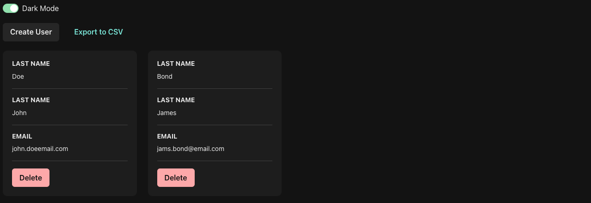
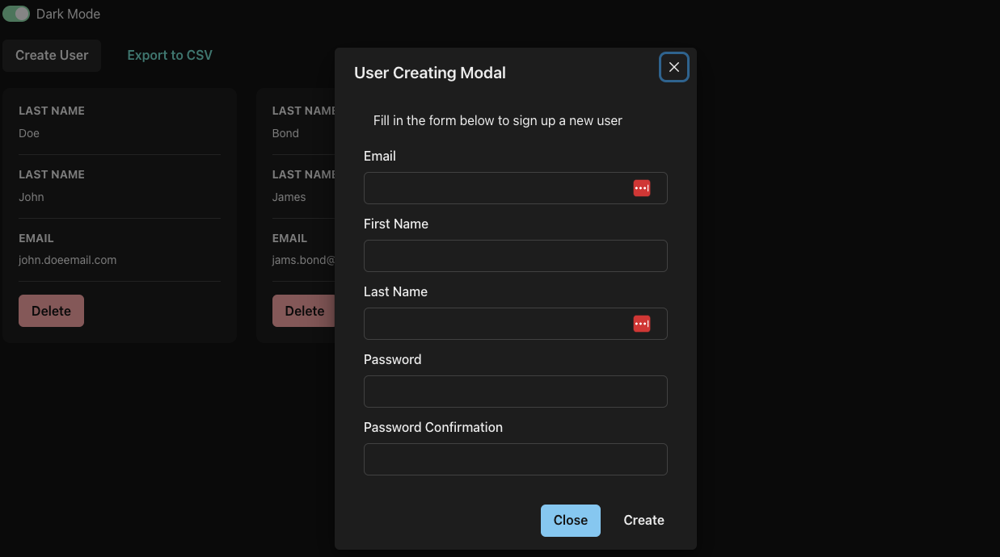

# Coding Challenge

## Documentation

- [Screenshots](#screenshots)
- [Techstack](#techstack)
- [Install and Run](#install-and-run)
- [Architecture](#architecture)
- [Future Improvements](#future-improvements)

## Screenshots




## Techstack

The project utilizes the following technologies and tools:

### Frontend

- **[React](https://react.dev/)**: A JavaScript library for building user interfaces.
- **[Chakra UI](https://v2.chakra-ui.com/getting-started)**: A simple, modular and accessible component library that provides a set of UI components for designing and animating user interfaces.
- **[Axios](https://axios-http.com/docs/intro)**: A Promise-based HTTP client used for making HTTP requests.
- **[TypeScript](https://www.typescriptlang.org/):**: A statically typed superset of JavaScript that adds static types, is used for safer and more reliable coding.
- **[Vite](https://vitejs.dev/)**: A next-generation front-end build tool and development server, is used for faster and leaner development.

### BackendInserting

1. **[TypeScript](https://www.typescriptlang.org/):** It's a typed superset of JavaScript, adding static types to the language. It helps in making the code more readable and less prone to runtime errors.
2. **[Express](https://expressjs.com/):** A minimal and flexible Node.js web application framework that provides a robust set of features for web and mobile applications.
3. **[Mongoose](https://mongoosejs.com/):** An Object Data Modeling (ODM) library for MongoDB and Node.js. It manages relationships between data, provides schema validation, and translates between objects in code and the representation of those objects in MongoDB.
4. **[Bcryptjs](https://www.npmjs.com/package/bcryptjs):** A library to help in hashing passwords.
5. **[JsonWebToken](https://www.npmjs.com/package/jsonwebtoken):** An implementation of JSON Web Tokens for secure transmission of information between parties as a JSON object.
6. **[Helmet](https://helmetjs.github.io/):** A collection of middleware functions to help secure Express apps by setting various HTTP headers.
7. **[Joi](https://joi.dev/):** A powerful schema description language and data validator for JavaScript.
8. **[Winston](https://www.npmjs.com/package/winston):** A multi-transport async logging library for Node.js.
9. **[Nodemon](https://nodemon.io/):** A tool that helps develop Node.js based applications by automatically restarting the node application when file changes in the directory are detected.
10. **[ESLint](https://eslint.org/):** A tool for identifying and reporting on patterns in JavaScript, helping developers write consistent code and find and fix errors.
11. **[Prettier](https://prettier.io/):** An opinionated code formatter that enforces a consistent style by parsing your code and reprinting it with its own rules.
12. **[Jest](https://jestjs.io/):** A delightful JavaScript Testing Framework with a focus on simplicity.
13. **[Serverless-http](https://www.npmjs.com/package/serverless-http):** A library to wrap your Node.js 'http/s' server for serverless use, making it easier to integrate with AWS Lambda and AWS HTTP API.

### Database

1. [MongoDB](https://www.mongodb.com/): is the database of choice.

## Install And Run

### Frontend

1. Navigate to the frontend directory to install packages.

   ```
   cd frontend/ && npm install
   ```

2. Build the fronted
   ```
   npm run build
   ```
3. Preview frontend UI
   ```
   npm run preview
   ```

### Backend

1. Copy and create your own enviroment.
   ```
   cp .env.example .env
   ```
2. Navigate to the backend directory to install packages.

   ```
   cd backend/ && npm install
   ```

3. Run lint and format on backend
   ```
   npm run lint && npm run format
   ```
4. Build the backend

   ```
   npm run build
   ```

## Architecture

Let's use files and folders to structure our backend application:

### Frontend

```
/src
│── main.tsx
│── App.tsx
│── App.css
│── theme.ts
│── components
│   └── UserGrid
│── hooks
│   ├── useUsers.ts
│   └── useData.ts
│── assets
│   └── vite.svg
└── services
    ├── api-client.ts
    ├── http-service.ts
    └── user-service.ts
```

This ReactJS project has a structured and organized directory layout. Here's what each directory or file is for:

- `main.tsx`: This is the main entry point of the React application.
- `theme.ts`: This file is used for defining the theme for styling the application. It can include colors, typography, spacing, etc.
- **Components**: This directory contains all the React components used in the application.
- **Hooks**: This directory contains custom hooks, which are a way to reuse stateful logic in React.
- **Assets**: This directory is used to store static files like images, fonts, etc.
- **Services**: This directory contains service files that handle API calls and interactions with backend services.

### Backend

```
/src
│── index.ts
├── startup
│   ├── config.ts
│   ├── routes.ts
│   ├── database.ts
│   └── logging.ts
│── common
│   ├── dtos
│   │   └── data-response.dto.ts
│   ├── enums
│   │   └── response-status.enum.ts
│   ├── interceptor
│   │   └── data-response.interceptor.ts
│   └── interfaces
│       └── custom-request.interface.ts
│── presentation
│   └── routers
│       └── user-router.ts
├── domain
│   ├── interfaces
│   │   ├── repositories
│   │   │    └── user-repository.interface.ts
│   │   └── use-cases
│   │       └── user
│   │           ├── get-all-users.use-case.ts
│   │           └── update-all-users.use-case.ts
│   ├── models
│   │   └── user.model.ts
│   ├── dtos
│   │   └── user.dto.ts
│   ├── repositories
│   │   └── user.repository.ts
│   └── use-cases
│       └── users
│           ├── get-all-users.use-case.ts
│           └── update-all-users.use.case.ts
│
└── data
    ├── interfaces
    │   └── data-sources
    │       ├── nosql-database-wrapper.interface.ts
    │       └── user-data-source.interface.ts
    ├── instances
    │   └── user-database.ts
    ├── seeders
    │   ├── index.ts
    │   └── user.seeder.ts
    └── data-sources
        └── mongodb
           └── mongodb-user-data-source.ts

/test
│── main.tsx
│── data
│   └── data-sources
│       └── mongodb
│           └── mongodb-user-data-source.spec.ts
└── domain
    └── repositories
        └── user.repository.spec.ts

```

- The **presentation layer** would mainly be used for inputting and outputting user data (API routes).

- The inner core **domain layer** holds all business logic (use cases, repositories).

- The **data layer** holds all infrastructure implementations (data sources).

- **Common**: include entire common stuffs of the project

- **Startup**: contains files for project configuration and loading such as: config.ts, database.ts, ...

- **Use Cases**: have one or more repository dependencies and will be constructor injected. Use cases are structured in a way that each use case has one method, the execute method, which holds all business logic for that use case.

- **Repository**: The main purpose of the repository is to know and marshall data sources and services.

## Future Improvements

- Frontend Site

  - Add user login/logout feature.
  - Improve UI/UX for both mobile and web.

- Backend Site:

  - Add comprehensive test cases.
  - Add more layers to protect our application such as (middlewares, interceptors, dtos, ...).
